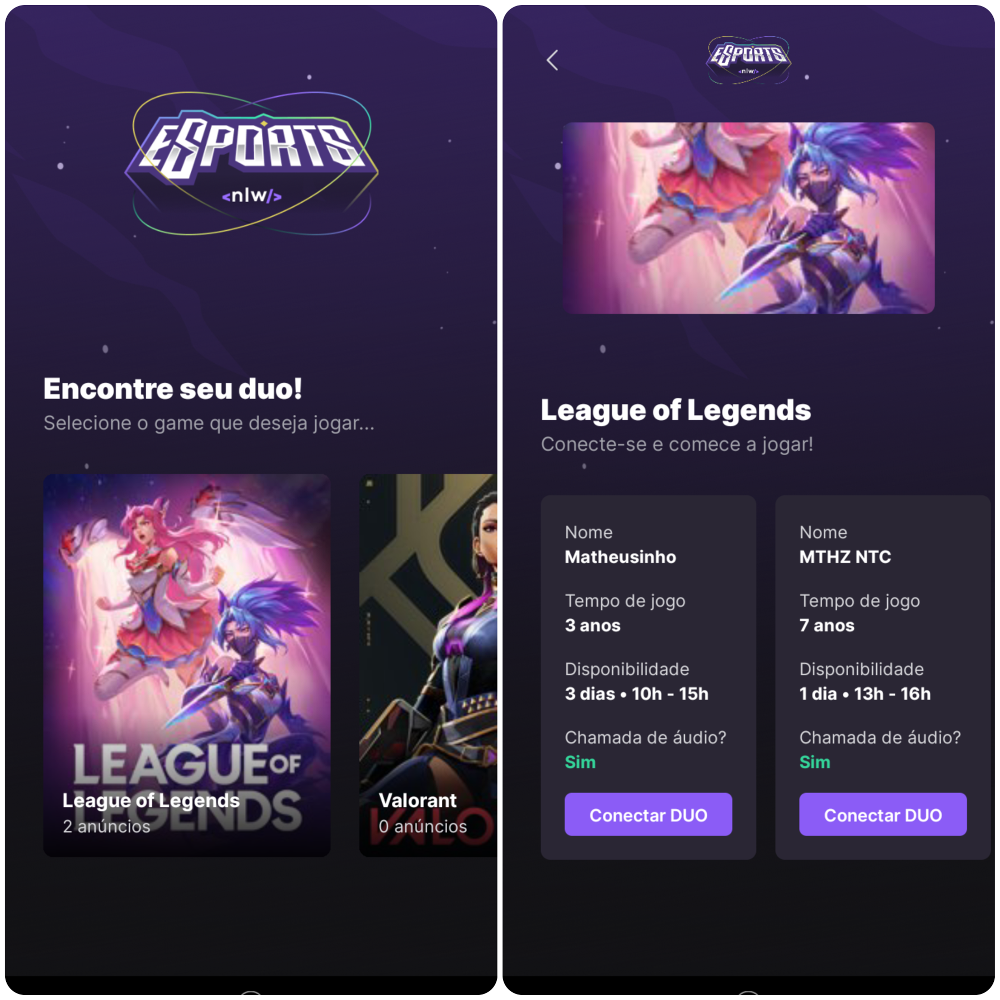

<h1 align="center">
    
</h1>

  

<h2>📱 Sobre</h2>

O find your DUO-mobile é uma aplicação mobile para encontrar pessoas para jogar junto com você seus jogos preferidos. Nele você pode visualizar anúncios de parceria em jogos que outras pessoas criaram, e se conectar a elas através do Discord.

 
<h2>🎯 Objetivo</h2>

O find your DUO-mobile foi a minha primeira experiência desenvolvendo uma aplicação mobile. Meu objetivo foi entender como funciona a construção de uma aplicação deste tipo, quais as variáveis que eu tenho que me preocupar (acesso aos arquivos do celular do usuário, detalhes na tela do usuário, tela de carregamento, etc.) e quais as semelhanças em desenvolver aplicações mobile e aplicações web.

 
<h2>🛠️ Tecnologias e ferramentas/bibliotecas utilizadas</h2>
<ul>
  <li><a href="https://reactnative.dev/">React-Native</a></li>
  <li><a href="https://www.typescriptlang.org/">Typescript</a></li>
  <li><a href="https://expo.dev/">Expo</a></li>
</ul>
 
<h2>🔖 Layout</h2>

Você pode visualizar o layout do projeto através deste link: <a href="https://www.figma.com/community/file/1150897317533332617">Layout do projeto</a>. É necessário possuir uma conta no <a href="https://figma.com">Figma</a> para acessá-lo.

 
 

Made by Matheus Pazinati 🛸
